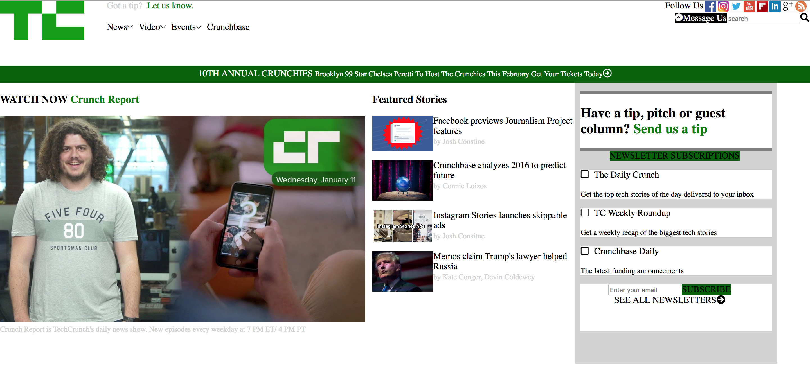

# My Awesome Project
Copy of a Tech Crunch page  Be sure to include a link and a screenshot (we're front end devs so we can actually see our work!).

**Link to project:** https://app.netlify.com/sites/vigorous-cori-722913/overview

## How It's Made:

**Tech used:** HTML & CSS

Used HTML and CSS to make a replica Tech Crunch web page.

## Optimizations
I came back and tweaked this page after I had discovered a breakthrough with CSS and spacing.

## Lessons Learned:

This project furthered my understanding of CSS and spacing.

## Examples:
Take a look at these couple examples that I have in my own portfolio:

**Palettable:** https://github.com/alecortega/palettable

**Twitter Battle:** https://github.com/alecortega/twitter-battle

**Patch Panel:** https://github.com/alecortega/patch-panel
